# ARCHITECTURE.md

## Overview

This document provides an architectural overview of the codebase, detailing the dependencies and key entities within each file. The codebase is structured around a set of JavaScript modules, each responsible for specific functionalities. The architecture is designed to be modular, with clear separation of concerns, allowing for maintainability and scalability.

## Core Components

### Middleware

- **File:** `middleware.js`
- **Entities:** `middleware`
- **Dependencies:** None

### Application Pages

- **Home Page**
  - **File:** `app/page.js`
  - **Entities:** `HomePage`
  - **Dependencies:** `hooks/useStudentSession.js`

- **Root Layout**
  - **File:** `app/layout.js`
  - **Entities:** `RootLayout`
  - **Dependencies:** 
    - `components/SiteFooter.js`
    - `components/SiteHeader.js`
    - `components/AppThemeProvider.js`

- **Application Page**
  - **File:** `app/application/page.js`
  - **Entities:** `ApplicationContent`, `ApplicationPage`
  - **Dependencies:**
    - `hooks/useStudentSession.js`
    - `components/RegistrationForm.js`
    - `lib/supabase.js`
    - `lib/registrationService.js`

- **Admin Page**
  - **File:** `app/admin/page.js`
  - **Entities:** `AdminLoginCard`, `AdminPage`
  - **Dependencies:**
    - `lib/supabase.js`
    - `lib/authSession.js`
    - `components/RegistrationsDataGrid.js`

- **Dashboard Page**
  - **File:** `app/dashboard/page.js`
  - **Entities:** `DashboardPage`
  - **Dependencies:**
    - `hooks/useStudentSession.js`
    - `components/DocumentChecklist.js`
    - `lib/supabase.js`
    - `lib/registrationService.js`

- **Login Page**
  - **File:** `app/login/page.js`
  - **Entities:** `LoginFallback`, `Page`
  - **Dependencies:** `app/login/LoginPage.js`

- **Login Page (Detailed)**
  - **File:** `app/login/LoginPage.js`
  - **Entities:** `GoogleIcon`, `LoginPage`
  - **Dependencies:**
    - `lib/supabase.js`
    - `lib/phoneAuth.js`
    - `lib/uiClasses.js`
    - `lib/googleAuth.js`

### Authentication

- **Auth Callback Route**
  - **File:** `app/auth/callback/route.js`
  - **Entities:** `readSupabaseEnv`, `GET`
  - **Dependencies:** `lib/supabase.js`

### Hooks

- **Use Student Session**
  - **File:** `hooks/useStudentSession.js`
  - **Entities:** `linkExistingRegistration`, `useStudentSession`
  - **Dependencies:**
    - `lib/authSession.js`
    - `lib/formState.js`
    - `lib/supabase.js`
    - `lib/registrationService.js`

### Components

- **Site Header**
  - **File:** `components/SiteHeader.js`
  - **Entities:** `SiteHeader`
  - **Dependencies:** `hooks/useStudentSession.js`

- **Declaration Modal**
  - **File:** `components/DeclarationModal.js`
  - **Entities:** `DeclarationModal`
  - **Dependencies:** None

- **Registration Form**
  - **File:** `components/RegistrationForm.js`
  - **Entities:** `RegistrationForm`
  - **Dependencies:**
    - `lib/uiClasses.js`
    - `lib/supabase.js`
    - `components/DocumentActions.js`
    - `lib/formState.js`
    - `lib/validation.js`
    - `components/DeclarationModal.js`
    - `lib/formOptions.js`
    - `lib/indiaLocations.js`
    - `lib/documents.js`
    - `lib/registrationService.js`

- **Document Checklist**
  - **File:** `components/DocumentChecklist.js`
  - **Entities:** `DocumentChecklist`
  - **Dependencies:**
    - `components/DocumentActions.js`
    - `lib/uiClasses.js`

- **Registrations Data Grid**
  - **File:** `components/RegistrationsDataGrid.js`
  - **Entities:** `getUploadedDocuments`, `getDocumentFileEntries`, `getPaymentScreenshotFileEntries`, `RegistrationFilesDialog`, `FilePreviewCell`, `StatusChip`, `RegistrationsDataGrid`
  - **Dependencies:** `components/DocumentActions.js`

- **App Theme Provider**
  - **File:** `components/AppThemeProvider.js`
  - **Entities:** `AppThemeProvider`
  - **Dependencies:** None

- **Site Footer**
  - **File:** `components/SiteFooter.js`
  - **Entities:** `SiteFooter`
  - **Dependencies:** None

- **Document Actions**
  - **File:** `components/DocumentActions.js`
  - **Entities:** `DocumentActions`
  - **Dependencies:**
    - `lib/downloadDocument.js`
    - `lib/uiClasses.js`

### Libraries

- **Form Options**
  - **File:** `lib/formOptions.js`
  - **Entities:** `getLatestAllowedBirthDate`
  - **Dependencies:** None

- **Form State**
  - **File:** `lib/formState.js`
  - **Entities:** `registrationToFormData`, `existingUrlsFromRegistration`, `getVerifiedMobileFromSession`
  - **Dependencies:** `lib/phoneAuth.js`

- **Phone Authentication**
  - **File:** `lib/phoneAuth.js`
  - **Entities:** `normalizeMobileInput`, `isValidIndianMobile`, `toE164IndianMobile`, `mobileFromE164`, `sendPhoneOtp`, `verifyPhoneOtp`
  - **Dependencies:** None

- **Download Document**
  - **File:** `lib/downloadDocument.js`
  - **Entities:** `getFileNameFromUrl`, `downloadDocument`
  - **Dependencies:** None

- **UI Classes**
  - **File:** `lib/uiClasses.js`
  - **Entities:** `mergeClasses`, `fileDropClass`, `inputClassName`
  - **Dependencies:** None

- **Registration Service**
  - **File:** `lib/registrationService.js`
  - **Entities:** `fetchMyRegistration`, `resolveRegistrationId`, `linkRegistrationByEmail`, `linkRegistrationByMobile`, `computePcbTotal`, `uploadFile`, `uploadDocumentFiles`, `buildRegistrationPayload`, `saveRegistrationDraft`, `submitRegistration`, `getMissingDocuments`, `getDocumentCompletion`
  - **Dependencies:** None

- **Authentication Session**
  - **File:** `lib/authSession.js`
  - **Entities:** `getAuthProviderFromSession`, `isAdminSession`, `isPhoneAuthSession`, `getGoogleEmailFromSession`, `getLoginDisplayFromSession`
  - **Dependencies:** None

- **Validation**
  - **File:** `lib/validation.js`
  - **Entities:** `isRequiredValue`, `validateFile`, `validateCommonFields`, `validateDraft`, `validateSubmit`, `validateForm`
  - **Dependencies:** `lib/indiaLocations.js`

- **India Locations**
  - **File:** `lib/indiaLocations.js`
  - **Entities:** `getCitiesForState`, `isValidStateCity`
  - **Dependencies:** None

- **Documents**
  - **File:** `lib/documents.js`
  - **Entities:** `createInitialDocumentFiles`
  - **Dependencies:** `app/login/page.js`

- **Declaration Content**
  - **File:** `lib/declarationContent.js`
  - **Entities:** `declarationContent.js`
  - **Dependencies:** None

- **Supabase**
  - **File:** `lib/supabase.js`
  - **Entities:** `readSupabaseEnv`, `isSupabaseConfigured`, `getSupabase`
  - **Dependencies:** None

- **Google Authentication**
  - **File:** `lib/googleAuth.js`
  - **Entities:** `signInWithGoogle`
  - **Dependencies:** None

## Dependency Diagram

Below is a Mermaid.js diagram illustrating the core interactions within the codebase:

```mermaid
graph TD;
  middleware.js -->|No Dependencies| middleware.js
  app/page.js --> hooks/useStudentSession.js
  app/layout.js --> components/SiteFooter.js
  app/layout.js --> components/SiteHeader.js
  app/layout.js --> components/AppThemeProvider.js
  app/application/page.js --> hooks/useStudentSession.js
  app/application/page.js --> components/RegistrationForm.js
  app/application/page.js --> lib/supabase.js
  app/application/page.js --> lib/registrationService.js
  app/auth/callback/route.js --> lib/supabase.js
  app/admin/page.js --> lib/supabase.js
  app/admin/page.js --> lib/authSession.js
  app/admin/page.js --> components/RegistrationsDataGrid.js
  app/dashboard/page.js --> hooks/useStudentSession.js
  app/dashboard/page.js --> components/DocumentChecklist.js
  app/dashboard/page.js --> lib/supabase.js
  app/dashboard/page.js --> lib/registrationService.js
  app/login/page.js --> app/login/LoginPage.js
  app/login/LoginPage.js --> lib/supabase.js
  app/login/LoginPage.js --> lib/phoneAuth.js
  app/login/LoginPage.js --> lib/uiClasses.js
  app/login/LoginPage.js --> lib/googleAuth.js
  hooks/useStudentSession.js --> lib/authSession.js
  hooks/useStudentSession.js --> lib/formState.js
  hooks/useStudentSession.js --> lib/supabase.js
  hooks/useStudentSession.js --> lib/registrationService.js
  components/SiteHeader.js --> hooks/useStudentSession.js
  components/RegistrationForm.js --> lib/uiClasses.js
  components/RegistrationForm.js --> lib/supabase.js
  components/RegistrationForm.js --> components/DocumentActions.js
  components/RegistrationForm.js --> lib/formState.js
  components/RegistrationForm.js --> lib/validation.js
  components/RegistrationForm.js --> components/DeclarationModal.js
  components/RegistrationForm.js --> lib/formOptions.js
  components/RegistrationForm.js --> lib/indiaLocations.js
  components/RegistrationForm.js --> lib/documents.js
  components/RegistrationForm.js --> lib/registrationService.js
  components/DocumentChecklist.js --> components/DocumentActions.js
  components/DocumentChecklist.js --> lib/uiClasses.js
  components/RegistrationsDataGrid.js --> components/DocumentActions.js
  components/DocumentActions.js --> lib/downloadDocument.js
  components/DocumentActions.js --> lib/uiClasses.js
  lib/validation.js --> lib/indiaLocations.js
  lib/documents.js --> app/login/page.js
```

This diagram provides a visual representation of the dependencies between the various modules in the codebase, highlighting the interconnected nature of the components and libraries.