# ARCHITECTURE.md

## Overview

This document provides an architectural overview of the codebase, detailing the dependencies and key entities within each file. The architecture is designed to support a web application with various pages and components, leveraging a modular approach to manage dependencies and functionality.

## Core Components

### Middleware

- **File:** `middleware.js`
- **Entities:** `middleware`
- **Dependencies:** None

### Application Pages

1. **Home Page**
   - **File:** `app/page.js`
   - **Entities:** `HomePage`
   - **Dependencies:** `hooks/useStudentSession.js`

2. **Application Page**
   - **File:** `app/application/page.js`
   - **Entities:** `ApplicationContent`, `ApplicationPage`
   - **Dependencies:** 
     - `lib/supabase.js`
     - `components/RegistrationForm.js`
     - `lib/registrationService.js`
     - `hooks/useStudentSession.js`

3. **Admin Page**
   - **File:** `app/admin/page.js`
   - **Entities:** `AdminLoginCard`, `AdminPage`
   - **Dependencies:** 
     - `lib/authSession.js`
     - `lib/supabase.js`
     - `components/RegistrationsDataGrid.js`

4. **Dashboard Page**
   - **File:** `app/dashboard/page.js`
   - **Entities:** `DashboardPage`
   - **Dependencies:** 
     - `lib/supabase.js`
     - `components/DocumentChecklist.js`
     - `lib/registrationService.js`
     - `hooks/useStudentSession.js`

5. **Login Page**
   - **File:** `app/login/page.js`
   - **Entities:** `LoginFallback`, `Page`
   - **Dependencies:** `app/login/LoginPage.js`

6. **Login Page (Detailed)**
   - **File:** `app/login/LoginPage.js`
   - **Entities:** `GoogleIcon`, `LoginPage`
   - **Dependencies:** 
     - `lib/supabase.js`
     - `lib/phoneAuth.js`
     - `lib/googleAuth.js`
     - `lib/uiClasses.js`

### Layout

- **File:** `app/layout.js`
- **Entities:** `RootLayout`
- **Dependencies:** 
  - `components/SiteHeader.js`
  - `components/SiteFooter.js`
  - `components/AppThemeProvider.js`

### Authentication Callback

- **File:** `app/auth/callback/route.js`
- **Entities:** `readSupabaseEnv`, `GET`
- **Dependencies:** `lib/supabase.js`

### Hooks

- **File:** `hooks/useStudentSession.js`
- **Entities:** `linkExistingRegistration`, `useStudentSession`
- **Dependencies:** 
  - `lib/authSession.js`
  - `lib/supabase.js`
  - `lib/registrationService.js`
  - `lib/formState.js`

### Components

1. **Site Header**
   - **File:** `components/SiteHeader.js`
   - **Entities:** `SiteHeader`
   - **Dependencies:** `hooks/useStudentSession.js`

2. **Declaration Modal**
   - **File:** `components/DeclarationModal.js`
   - **Entities:** `DeclarationModal`
   - **Dependencies:** None

3. **Registration Form**
   - **File:** `components/RegistrationForm.js`
   - **Entities:** `RegistrationForm`
   - **Dependencies:** 
     - `lib/supabase.js`
     - `lib/registrationService.js`
     - `lib/formState.js`
     - `lib/validation.js`
     - `lib/formOptions.js`
     - `lib/uiClasses.js`
     - `components/DocumentActions.js`
     - `lib/documents.js`
     - `lib/indiaLocations.js`
     - `components/DeclarationModal.js`

4. **Document Checklist**
   - **File:** `components/DocumentChecklist.js`
   - **Entities:** `DocumentChecklist`
   - **Dependencies:** 
     - `components/DocumentActions.js`
     - `lib/uiClasses.js`

5. **Registrations Data Grid**
   - **File:** `components/RegistrationsDataGrid.js`
   - **Entities:** 
     - `getUploadedDocuments`
     - `getDocumentFileEntries`
     - `getPaymentScreenshotFileEntries`
     - `RegistrationFilesDialog`
     - `FilePreviewCell`
     - `StatusChip`
     - `RegistrationsDataGrid`
   - **Dependencies:** `components/DocumentActions.js`

6. **App Theme Provider**
   - **File:** `components/AppThemeProvider.js`
   - **Entities:** `AppThemeProvider`
   - **Dependencies:** None

7. **Site Footer**
   - **File:** `components/SiteFooter.js`
   - **Entities:** `SiteFooter`
   - **Dependencies:** None

8. **Document Actions**
   - **File:** `components/DocumentActions.js`
   - **Entities:** `DocumentActions`
   - **Dependencies:** 
     - `lib/downloadDocument.js`
     - `lib/uiClasses.js`

### Libraries

1. **Form Options**
   - **File:** `lib/formOptions.js`
   - **Entities:** `getLatestAllowedBirthDate`
   - **Dependencies:** None

2. **Form State**
   - **File:** `lib/formState.js`
   - **Entities:** 
     - `registrationToFormData`
     - `existingUrlsFromRegistration`
     - `getVerifiedMobileFromSession`
   - **Dependencies:** `lib/phoneAuth.js`

3. **Phone Authentication**
   - **File:** `lib/phoneAuth.js`
   - **Entities:** 
     - `normalizeMobileInput`
     - `isValidIndianMobile`
     - `toE164IndianMobile`
     - `mobileFromE164`
     - `sendPhoneOtp`
     - `verifyPhoneOtp`
   - **Dependencies:** None

4. **Download Document**
   - **File:** `lib/downloadDocument.js`
   - **Entities:** 
     - `getFileNameFromUrl`
     - `downloadDocument`
   - **Dependencies:** None

5. **UI Classes**
   - **File:** `lib/uiClasses.js`
   - **Entities:** 
     - `mergeClasses`
     - `fileDropClass`
     - `inputClassName`
   - **Dependencies:** None

6. **Registration Service**
   - **File:** `lib/registrationService.js`
   - **Entities:** 
     - `fetchMyRegistration`
     - `resolveRegistrationId`
     - `linkRegistrationByEmail`
     - `linkRegistrationByMobile`
     - `computePcbTotal`
     - `uploadFile`
     - `uploadDocumentFiles`
     - `buildRegistrationPayload`
     - `saveRegistrationDraft`
     - `submitRegistration`
     - `getMissingDocuments`
     - `getDocumentCompletion`
   - **Dependencies:** None

7. **Authentication Session**
   - **File:** `lib/authSession.js`
   - **Entities:** 
     - `getAuthProviderFromSession`
     - `isAdminSession`
     - `isPhoneAuthSession`
     - `getGoogleEmailFromSession`
     - `getLoginDisplayFromSession`
   - **Dependencies:** None

8. **Validation**
   - **File:** `lib/validation.js`
   - **Entities:** 
     - `isRequiredValue`
     - `validateFile`
     - `validateCommonFields`
     - `validateDraft`
     - `validateSubmit`
     - `validateForm`
   - **Dependencies:** `lib/indiaLocations.js`

9. **India Locations**
   - **File:** `lib/indiaLocations.js`
   - **Entities:** 
     - `getCitiesForState`
     - `isValidStateCity`
   - **Dependencies:** None

10. **Documents**
    - **File:** `lib/documents.js`
    - **Entities:** `createInitialDocumentFiles`
    - **Dependencies:** `app/login/page.js`

11. **Declaration Content**
    - **File:** `lib/declarationContent.js`
    - **Entities:** `declarationContent.js`
    - **Dependencies:** None

12. **Supabase**
    - **File:** `lib/supabase.js`
    - **Entities:** 
      - `readSupabaseEnv`
      - `isSupabaseConfigured`
      - `getSupabase`
    - **Dependencies:** None

13. **Google Authentication**
    - **File:** `lib/googleAuth.js`
    - **Entities:** `signInWithGoogle`
    - **Dependencies:** None

## Mermaid.js Diagram

Below is a Mermaid.js diagram illustrating the core interactions and dependencies within the codebase:

```mermaid
graph TD;
    middleware.js -->|No Dependencies| middleware;
    app/page.js --> hooks/useStudentSession.js;
    app/layout.js --> components/SiteHeader.js;
    app/layout.js --> components/SiteFooter.js;
    app/layout.js --> components/AppThemeProvider.js;
    app/application/page.js --> lib/supabase.js;
    app/application/page.js --> components/RegistrationForm.js;
    app/application/page.js --> lib/registrationService.js;
    app/application/page.js --> hooks/useStudentSession.js;
    app/auth/callback/route.js --> lib/supabase.js;
    app/admin/page.js --> lib/authSession.js;
    app/admin/page.js --> lib/supabase.js;
    app/admin/page.js --> components/RegistrationsDataGrid.js;
    app/dashboard/page.js --> lib/supabase.js;
    app/dashboard/page.js --> components/DocumentChecklist.js;
    app/dashboard/page.js --> lib/registrationService.js;
    app/dashboard/page.js --> hooks/useStudentSession.js;
    app/login/page.js --> app/login/LoginPage.js;
    app/login/LoginPage.js --> lib/supabase.js;
    app/login/LoginPage.js --> lib/phoneAuth.js;
    app/login/LoginPage.js --> lib/googleAuth.js;
    app/login/LoginPage.js --> lib/uiClasses.js;
    hooks/useStudentSession.js --> lib/authSession.js;
    hooks/useStudentSession.js --> lib/supabase.js;
    hooks/useStudentSession.js --> lib/registrationService.js;
    hooks/useStudentSession.js --> lib/formState.js;
    components/SiteHeader.js --> hooks/useStudentSession.js;
    components/RegistrationForm.js --> lib/supabase.js;
    components/RegistrationForm.js --> lib/registrationService.js;
    components/RegistrationForm.js --> lib/formState.js;
    components/RegistrationForm.js --> lib/validation.js;
    components/RegistrationForm.js --> lib/formOptions.js;
    components/RegistrationForm.js --> lib/uiClasses.js;
    components/RegistrationForm.js --> components/DocumentActions.js;
    components/RegistrationForm.js --> lib/documents.js;
    components/RegistrationForm.js --> lib/indiaLocations.js;
    components/RegistrationForm.js --> components/DeclarationModal.js;
    components/DocumentChecklist.js --> components/DocumentActions.js;
    components/DocumentChecklist.js --> lib/uiClasses.js;
    components/RegistrationsDataGrid.js --> components/DocumentActions.js;
    components/DocumentActions.js --> lib/downloadDocument.js;
    components/DocumentActions.js --> lib/uiClasses.js;
    lib/validation.js --> lib/indiaLocations.js;
    lib/documents.js --> app/login/page.js;
```

This diagram provides a visual representation of the dependencies and interactions between the various components and libraries within the codebase.